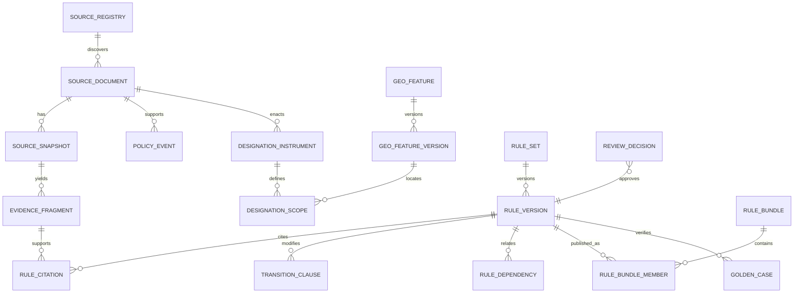
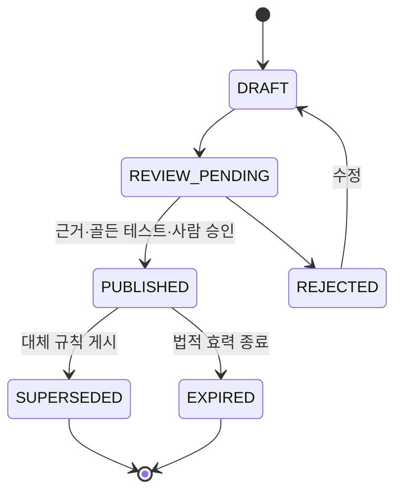

# 데이터 모델

**기준일**: 2026-07-10  
**저장소**: PostgreSQL 18 + PostGIS + pgvector  
**시간 규칙**: Asia/Seoul, `[시작, 종료)` 반개구간

## 모델링 원칙

1. 정부 원문과 추출·정규화·게시 결과를 덮어쓰지 않는다.
2. 현실의 효력시간과 시스템이 알고 있던 시간을 분리한다.
3. 행정구역·필지·공식 도면은 각각 버전된 공간 객체다.
4. 정책 설명 문서와 법적 효력이 있는 고시·공고를 구분한다.
5. 세목별 주택 수는 사용자 입력이 아니라 규칙 버전이 산출한 파생 사실이다.
6. 사용자 시나리오는 기본적으로 API 값 객체이며 영구 엔터티가 아니다.
7. 모든 공개 판정은 고정된 규칙 번들과 근거 묶음으로 재현할 수 있어야 한다.

## 관계 개요



## 공통 규칙

### 식별자

- 내부 기본키는 시간 정렬 가능한 UUIDv7을 쓴다.
- 외부 안정 식별자는 별도 `stable_key`로 보존한다.
- 규칙 ID는 `KR.{세목|제도}.{주제}` 형식의 읽을 수 있는 문자열이다.
- 해시는 SHA-256을 사용하고 `sha256:{hex}` 형식으로 저장한다.

### 이중시간

게시되는 법적 사실에는 다음 열이 필요하다.

| 열 | 의미 |
|---|---|
| `valid_from`, `valid_to` | 현실에서 효력이 있는 기간 |
| `recorded_from`, `recorded_to` | 시스템의 게시 스냅샷에서 참으로 기록된 기간 |
| `published_at` | 기관이 발표한 시각 |
| `promulgated_at` | 공포·고시된 시각 |
| `observed_at` | 수집·검증 작업이 확인한 시각 |

`valid_to`와 `recorded_to`가 없으면 열린 구간이다. 소급 정정 시 이전 행의
`recorded_to`만 닫고 새로운 사실 버전을 만든다. 과거 `valid_time`을 수정해도
기존 시스템 관측 이력을 삭제하지 않는다.

### 금액과 비율

- 원화 금액은 `numeric(24,0)` 또는 애플리케이션 `Decimal`로 처리한다.
- 세율은 `numeric(12,8)` 또는 정수 basis point로 저장하며 부동소수점을 쓰지 않는다.
- 반올림·절사 단위와 적용 순서는 규칙 결과의 `calculation_line`에 남긴다.
- 계산 결과는 본세·지방세·부가세목과 미포함 항목을 분리한다.

## 출처·근거 도메인

### `source_registry`

출처별 수집·권리·신선도 정책이다.

| 필드 | 타입 | 제약·설명 |
|---|---|---|
| `id` | uuid | PK |
| `stable_key` | text | UNIQUE, 예: `molit.press_release` |
| `authority_name` | text | 발행기관 |
| `base_url` | text | HTTPS |
| `source_role_default` | enum | 아래 역할 중 하나 |
| `freshness_sla_hours` | int | 양수 |
| `robots_checked_at` | timestamptz | 확인 시각 |
| `terms_checked_at` | timestamptz | 이용조건 확인 시각 |
| `rights_policy` | enum | `ALLOWED`, `LINK_ONLY`, `REVIEW_REQUIRED`, `BLOCKED` |
| `request_policy` | jsonb | 속도 제한, 조건부 요청, API 한도 |
| `enabled` | boolean | 수집 가능 여부 |

`source_role`: `LEGAL_EFFECT`, `BOUNDARY`, `EXPLANATION`, `STATUS_INDEX`,
`DISCOVERY_ONLY`.

### `source_document`

논리적 정부 문서다.

| 필드 | 설명 |
|---|---|
| `id`, `stable_key` | 내부·외부 안정 식별자 |
| `source_registry_id` | 출처 |
| `authority_name` | 발행기관 원문 표기 |
| `title`, `document_number` | 문서명·번호 |
| `document_type` | 법령, 고시, 공고, 보도자료, 안내 등 |
| `source_role` | 판정에서의 역할 |
| `canonical_url`, `attachment_urls` | 원문과 첨부 링크 |
| `published_at`, `promulgated_at` | 발표·공포 시각 |
| `rights_status` | 원문 보존·공개·색인 권리 상태 |

### `source_snapshot`

같은 URL에서 관찰한 불변 응답이다.

| 필드 | 설명 |
|---|---|
| `id`, `source_document_id` | 식별자와 논리 문서 |
| `retrieved_at` | 수집 시각 |
| `content_sha256` | UNIQUE 문서 바이트 해시 |
| `blob_uri` | 권리가 허용될 때의 내부 불변 객체 위치 |
| `mime_type`, `byte_length` | 응답 메타데이터 |
| `http_status`, `etag`, `last_modified` | 조건부 요청 메타데이터 |
| `previous_snapshot_id` | 이전 관측 버전 |
| `change_kind` | `NEW`, `UNCHANGED`, `CHANGED`, `REMOVED`, `BLOCKED` |
| `ingestion_run_id` | 생성 작업 |

### `evidence_fragment`

검수 가능한 최소 근거 조각이다.

| 필드 | 설명 |
|---|---|
| `source_snapshot_id` | 불변 원문 |
| `selector_type`, `selector_value` | 조문, 페이지, 표, 문단, 문자 오프셋 |
| `text` | 권리 허용 범위의 정규화 텍스트 |
| `text_sha256` | 조각 해시 |
| `language` | 기본 `ko` |
| `embedding` | nullable vector |
| `search_tsv` | PostgreSQL 전문 검색 벡터 |
| `review_status` | `DRAFT`, `REVIEWED`, `PUBLISHED`, `REJECTED` |
| `rights_status` | RAG 사용 가능 여부 |

`review_status=PUBLISHED`이고 `rights_status=ALLOWED`인 조각만 생성형 설명에 쓸 수 있다.

### `verification_run`

`checked_at`을 법적 사실 본체에서 분리한 확인 작업이다.

- 출처와 검색 범위
- 시작·종료 시각
- 확인한 최신 공고 번호와 URL
- 결과 `CURRENT`, `CHANGED`, `CONFLICT`, `UNAVAILABLE`, `PARTIAL`
- 자동 검사 결과와 검수자
- 신선도 기한

## 정책·지역 도메인

### `policy_program`과 `policy_event`

`policy_program`은 장기간 이어지는 정책 주제다. `policy_event`는 발표·공포·시행·
유예·지정·해제·연장·정정·종료와 같은 한 번의 사건이다.

`policy_event` 핵심 필드:

- `event_type`
- `event_at`
- `headline`, `summary`
- `policy_program_id`
- `source_document_id`
- `supersedes_event_id`
- `verification_status`

정책 발표 사건이 법적 지정 수단을 대체하지 않는다.

### `geo_feature`와 `geo_feature_version`

`geo_feature`는 행정구역·법정동·필지·사업구역·공식 도면의 안정 식별자다.
`geo_feature_version`은 특정 기간의 코드, 명칭과 공간을 보존한다.

| 필드 | 설명 |
|---|---|
| `feature_type` | `ADMIN`, `LEGAL_DONG`, `PARCEL`, `PROJECT`, `OFFICIAL_DRAWING` |
| `authority_key` | 행정 코드, PNU 또는 기관 식별자 |
| `name`, `code` | 해당 버전의 표기 |
| `valid_from`, `valid_to` | 경계·코드 유효기간 |
| `recorded_from`, `recorded_to` | 시스템이 해당 경계를 게시 사실로 알고 있던 기간 |
| `geometry` | PostGIS `geometry(MultiPolygon, 5179)` |
| `source_snapshot_id` | 경계 원문 |
| `verification_run_id` | 이 경계 버전을 확인한 작업 |
| `quality_status` | `OFFICIAL`, `DERIVED`, `PARTIAL`, `CONFLICT` |
| `parent_version_id` | 해당 시점의 상위 공간 |

WGS84 표시용 좌표는 조회 시 변환하고, 원본 좌표계와 변환 파이프라인을 기록한다.

### `designation_instrument`

하나의 법적 지정·해제·연장 수단이다.

- `designation_type`: `ADJUSTMENT_AREA`, `SPECULATION_OVERHEATED`,
  `SPECULATION_AREA`, `LAND_TRANSACTION_PERMIT`
- `authority_name`, `document_number`, `legal_basis`
- `instrument_kind`: 지정, 연장, 정정, 해제
- `valid_from`, `valid_to`, `recorded_from`, `recorded_to`
- `source_document_id`
- `supersedes_instrument_id`
- `review_status`

### `designation_scope`

하나의 공고 안에서 서로 다른 포함·제외·조건·시행일을 표현한다.

| 필드 | 설명 |
|---|---|
| `designation_instrument_id` | 법적 수단 |
| `geo_feature_version_id` | 행정구역·필지·도면 버전 |
| `inclusion_mode` | `INCLUDE`, `EXCLUDE` |
| `subject_types` | 내국인, 외국인, 법인 등 |
| `property_types` | 아파트, 단독, 연립, 다세대, 토지 등 |
| `land_use_types` | 주거·상업·공업·녹지 등 |
| `area_thresholds` | 용도별 최소·최대 면적과 포함 경계 |
| `same_complex_condition` | 동일 단지 조건 |
| `use_obligations` | 실거주·실경영 의무와 기간 |
| `permit_authority` | 허가권자 |
| `valid_from`, `valid_to` | 이 범위의 효력기간 |
| `recorded_from`, `recorded_to` | 시스템 관측·게시 기간 |
| `verification_run_id` | 범위·조건을 확인한 작업 |
| `evidence_fragment_id` | 공고·조서·도면 근거 |

### `address_resolution`

요청 수명 동안 쓰는 값 객체다. 기본 저장하지 않는다.

- 원문 주소의 메모리 내 값
- 정규화 주소
- 후보 PNU와 좌표
- 일치 방식 `EXACT_PARCEL`, `ROAD_TO_PARCEL`, `CENTROID`, `AMBIGUOUS`
- 사용한 `geo_feature_version_id`
- 신뢰도 대신 검증 가능한 품질 코드와 불확실성 사유

## 규칙·검수 도메인

### `rule_set`과 `rule_version`

`rule_set`은 안정 규칙 ID, `rule_version`은 불변 버전이다.

`rule_version` 핵심 필드:

- `semantic_version`, `content_sha256`
- `analysis_stage`: `ACQUISITION`, `HOLDING`, `DISPOSAL`
- `tax_type` 또는 `designation_type`
- `valid_from`, `valid_to`, `recorded_from`, `recorded_to`
- 정규화된 `condition_ast`, `effect_ast`, `unknown_policy`
- 번들 해시에 포함되는 순수·버전 고정 `derived_fact_function_versions`
- `status`: `DRAFT`, `REVIEW_PENDING`, `PUBLISHED`, `SUPERSEDED`, `EXPIRED`, `REJECTED`
- `created_by`, `created_at`

### `rule_dependency`

숫자 우선순위 대신 명시 관계를 쓴다.

- `OVERRIDES`
- `EXCLUDES`
- `SUPPRESSES`
- `SUPERSEDES`
- `REQUIRES`

동일 범위의 게시 규칙이 겹치고 명시 관계가 없으면 번들 컴파일을 실패시킨다.

### `transition_clause`

계약일·계약금 지급 증빙·잔금일·등기일·허가 여부처럼 규칙 본체와 다른 날짜·증빙
조건을 가진 경과규정이다.

- `stable_key`, `version`
- `affects_rule_version_id`
- `condition_ast`
- `effect`: 억제, 기간 연장, 대체율, 추가 요건
- `required_evidence_codes`
- `valid_from`, `valid_to`
- `rule_citations`

### `rule_citation`

규칙의 주장·조건·결과를 근거 조각과 연결한다.

- `rule_version_id`, `evidence_fragment_id`
- `claim_key`
- `citation_role`: `AUTHORITY`, `DEFINITION`, `RATE`, `EXCEPTION`, `TRANSITION`
- 검수한 인용 범위

### `golden_case`

- 정규화 입력 fixture와 해시
- 기준일과 세금 사건일
- 기대 파생 사실, 상태, 적용·제외 규칙, 계산 줄과 인용
- 경계 종류 `DATE_BEFORE`, `DATE_AT`, `DATE_AFTER`, `AMOUNT_MINUS_ONE`,
  `AMOUNT_AT`, `AMOUNT_PLUS_ONE`, `GEO_BOUNDARY`, `MISSING_FACT`
- 공식 예제 또는 검수자 근거

### `rule_bundle`과 `review_decision`

`rule_bundle`은 한 분석 요청에서 고정해 쓰는 게시 규칙 집합이다. 매니페스트,
멤버 규칙 해시, 엔진 버전, 컴파일러 버전, 골든 테스트 결과와 번들 해시를 가진다.

게시 전 조건:

- 모든 규칙이 검수 승인 상태
- 공식 근거와 해시 존재
- 의존 순환과 해결되지 않은 겹침 없음
- 관련 골든 사례 전체 통과
- RAG 인용 조각이 게시·권리 허용 상태

`review_decision`은 대상, 승인·반려·대체, 이유, 검수자, 시각과 테스트 실행을 기록한다.

## 분석 도메인

### 입력 값 객체

기본적으로 DB에 저장하지 않는 요청 DTO다.

- `AnalysisContext`: 분석 기준일, 단계, 거주자·개인/법인 구분. 세법상 사건일은 원시 계약·잔금·등기·취득·양도일로부터 규칙이 파생한다.
- `HouseholdTimeline`: 세대원 관계와 유효기간; 실명·주민등록번호 없음
- `PropertyInterest`: 현재·과거 부동산의 주소, PNU 후보, 유형, 실제 용도, 면적, 연도별 공시가격과 소유관계 목록
- `PropertyOwnershipInterest`: 세대원 키, 지분, 취득·처분 원인과 소유 유효기간. 현재 세대뿐 아니라 과거 처분 주택과 당시 세대 귀속을 표현한다.
- `TransactionPlan`: 계약·계약금·잔금·등기·취득·양도일과 가격·비용·증빙 여부
- `ResidencePeriod`: 시작·종료일 목록
- `HoldingSnapshot`: 특정 기준일의 주택·입주권·분양권·주거용 오피스텔 보유 사실

`주택 수`는 DTO에 받지 않는다. `home_count.acquisition`, `home_count.cgt`,
`home_count.comprehensive_holding_tax`를 규칙이 파생한다.

`PropertyOwnershipInterest.owner_member_key`는 `HouseholdTimeline.member_key`를 참조한다.
구성원별 관계·세대 귀속과 소유기간이 겹치는 기준일에서만 해당 세대의 주택 수에
포함할 수 있다. 생애최초·보유세 표준 사례에는 연도·구성원별 소득 기록,
연도별 공시가격과 직전 과세표준·세부담 기록을 선택 입력으로 받으며, 필요한 값이
없으면 `NEEDS_INPUT` 또는 `ESTIMATED`로 끝낸다.

### 분석 결과

| 객체 | 역할 |
|---|---|
| `AnalysisResult` | 전체 상태, 입력 요약, 번들·엔진·입력 정규화 해시 |
| `DerivedFact` | 값, 산출 규칙, 기준일, 사용한 원천 사실 |
| `RuleEvaluation` | 각 조건의 `TRUE`, `FALSE`, `UNKNOWN`과 추적 트리 |
| `CalculationLine` | 본세·부가세목·공제·반올림을 포함한 계산 줄 |
| `MissingFact` | 영향도, 질문, 허용 값, 미입력 시 영향 |
| `ReviewFlag` | 공식 확인·전문가 검토 사유 코드 |
| `CitationBundle` | 규칙별 원문 인용 묶음 |

전체 결과 상태:

- `DETERMINED`: 지원 범위에서 필요한 사실이 모두 있고 결정론적으로 산출
- `ESTIMATED`: 일부 공시가격·비용 등의 개략값으로 범위 산출
- `NEEDS_INPUT`: 지원 범위지만 필수 사실 부족
- `REQUIRES_OFFICIAL_CHECK`: 공식 필지·증빙·충돌 확인 필요
- `UNSUPPORTED`: v1 지원 행렬 밖 사례

확률형 `confidence`는 법률·세금 판정 오해를 만들 수 있어 반환하지 않는다.

### 선택 저장

v1 공개 API는 원시 시나리오를 저장하지 않는다. 향후 `saved_scenario`를 추가하려면
명시적 동의, 암호화, TTL, 삭제·내보내기, 감사 정책과 별도 개인정보 영향평가가
선행되어야 한다. 운영 로그에는 요청 ID, 번들 해시, 결과 상태와 지연 시간만 남기고
주소·금액·보유 내역은 남기지 않는다.

## 상태 전이



미검수 `DRAFT`와 `REVIEW_PENDING`은 분석 번들 및 RAG 검색에 포함되지 않는다.

## 무결성·인덱스

- GiST: `geo_feature_version.geometry`, 유효 기간 range
- GIN: `evidence_fragment.search_tsv`, JSONB 조건 조회용 보조 인덱스
- HNSW: 게시 근거 조각의 embedding; 정형 필터 후 사용
- UNIQUE: 문서 바이트 해시, 규칙 `(stable_key, semantic_version)`, 번들 해시
- CHECK: 기간 시작 < 종료, 금액 정수, 허용 상태 전이
- 게시 부분 인덱스: `status='PUBLISHED'`와 열린 `recorded_to`
- 겹침 방지: 규칙뿐 아니라 `geo_feature_version`과 `designation_scope`도 동일 안정 ID의 게시 시스템 시간 구간에 exclusion constraint

## 삭제·보존

- 정부 원문 스냅샷과 게시 규칙은 법적·권리 정책이 허용하는 범위에서 감사 목적으로 보존한다.
- 공개 노출 철회와 내부 감사 보존을 별도 상태로 관리한다.
- 권리 미확인 원문은 전문을 공개·색인하지 않고 메타데이터와 링크만 유지한다.
- 분석 요청 본문은 응답 완료 후 폐기한다.

---

## AI Context (English)

```yaml
database: postgresql_18
extensions: [postgis, pgvector]
time_semantics:
  zone: Asia/Seoul
  interval: half_open
  axes: [valid_time, recorded_time]
core_aggregates:
  provenance: [SourceRegistry, SourceDocument, SourceSnapshot, EvidenceFragment, VerificationRun]
  policy: [PolicyProgram, PolicyEvent]
  geography: [GeoFeature, GeoFeatureVersion, DesignationInstrument, DesignationScope]
  rules: [RuleSet, RuleVersion, RuleDependency, TransitionClause, RuleBundle, GoldenCase, ReviewDecision]
analysis_persistence: ephemeral_by_default
analysis_status: [DETERMINED, ESTIMATED, NEEDS_INPUT, REQUIRES_OFFICIAL_CHECK, UNSUPPORTED]
critical_invariants:
  - source_snapshots_are_immutable
  - valid_time_and_recorded_time_are_separate
  - tax_specific_home_counts_are_derived_facts
  - only_published_rules_and_evidence_are_executable_or_retrievable
  - analysis_uses_one_immutable_rule_bundle
```
