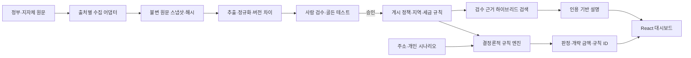

# 구현 계획: 대한민국 부동산 정책·세금 분석 대시보드

**브랜치**: `001-real-estate-policy-dashboard` | **작성일**: 2026-07-10

**기능 명세**: [spec.md](./spec.md) | **헌장**: [constitution.md](../../.specify/memory/constitution.md)

## 요약

대한민국 주택 부동산을 대상으로 선택한 기준일에 실제로 효력이 있는 정책과
규제지역을 보여주고, 주소 및 사용자의 취득·보유·양도 상황을 결정론적 규칙으로
분석하는 웹 서비스를 구현한다. 정부 원문은 불변 스냅샷과 해시로 보존하고,
정책·지역·세금 규칙은 유효시간과 관측시간을 모두 갖는 버전으로 게시한다.
RAG는 검수·게시된 원문을 검색하여 결과를 설명하지만 적용 여부와 세액 범위를
결정하지 않는다.

MVP는 다음 순서로 전달한다.

1. 현재 적용 정책과 주소별 규제지역 판정
2. 취득·보유·양도 시나리오와 세금·비과세·중과 가능성 분석
3. 최근 10년 정책 이력과 근거 인용 질의응답
4. 정부 원문 수집, 변경 탐지, 검수, 게시를 위한 관리자 작업대

## 기술 컨텍스트

| 항목 | 결정 |
|---|---|
| 언어·버전 | Python 3.14, TypeScript 5.x, Node.js 24 LTS |
| 백엔드 | FastAPI, Pydantic 2, SQLAlchemy 2, Alembic |
| 프런트엔드 | React 19.2, Vite 8.1, Tailwind CSS 4.3 |
| 저장소 | PostgreSQL 18, PostGIS 3.6, pgvector 0.8 계열 |
| 검색 | PostgreSQL 전문 검색과 pgvector를 결합한 하이브리드 검색 |
| 테스트 | pytest, pytest-asyncio, Hypothesis, Vitest, Testing Library, Playwright |
| 계약 | OpenAPI 3.1, JSON Schema 2020-12 |
| 대상 플랫폼 | 컨테이너 기반 Linux API와 정적 웹 앱, 최신 모바일·데스크톱 브라우저 |
| 프로젝트 유형 | React SPA와 Python API를 분리한 웹 애플리케이션 |
| 성능 목표 | 캐시된 현재 정책 p95 300ms, 주소 판정 p95 1.5s, 순수 규칙 평가 p95 300ms·분석 API p95 2s, 근거 검색 p95 4s |
| 신뢰성 목표 | 게시된 규칙의 동일 입력·기준일·버전은 동일 결과, 근거 없는 확정 판정 0건 |
| 개인정보 제약 | 주민등록번호·등기번호 수집 금지, 기본 무저장, 로그의 원문 주소·금액 마스킹 |
| 초기 규모 | 최근 10년 정책 이벤트, 전국 행정구역, 검수된 규칙 수백 개, 초기 동시 사용자 100명 |

### 선택한 아키텍처



핵심 실행 경계는 다음과 같다.

- `규칙 엔진`: 주소, 기준일, 거래일, 보유 현황과 게시된 규칙 버전으로
  `APPLIES`, `DOES_NOT_APPLY`, `CONDITIONAL`, `NEEDS_INPUT`,
  `REQUIRES_OFFICIAL_CHECK`, `UNSUPPORTED`를 산출한다.
- `RAG`: 게시되고 권리 검토가 끝난 근거만 검색하며 규칙 엔진 결과를 변경하지 않는다. 개인 적용 여부·세액 질문은 답을 생성하지 않고 분석 API로 안내한다.
- `관리자 검수`: 원문, 이전 버전 차이, 추출값, 규칙 초안, 영향받는 골든 사례를
  검토한 뒤 게시한다.
- `현재 정책 뷰`: `valid_from <= as_of < valid_to`이고 `PUBLISHED`인 항목만 기본 노출한다.
- `현재 정책 근거`: 해시와 정확한 selector가 있는 `LEGAL_EFFECT` 또는 `BOUNDARY` 정부 원문을 최소 1개 요구한다.
- `이력 뷰`: 예정·종료·해제·대체 상태를 숨기지 않고 별도 타임라인에서 보여준다.

## 헌장 준수 점검

### Phase 0 이전 점검

| 헌장 원칙 | 설계 반영 | 결과 |
|---|---|---|
| 정부 원문 우선 | 출처 역할, 원문 URL, 첨부 URL, 해시, 권리 상태, 수집 스냅샷을 저장한다. | 통과 |
| 시공간 정확성 | 정책 발표와 법적 지정 공고를 분리하고 유효시간·관측시간·공간 버전을 관리한다. | 통과 |
| 규칙이 판정, RAG가 설명 | 제한된 규칙 DSL과 인용 전용 검색 경계를 API·데이터 모델에 명시한다. | 통과 |
| 안전·개인정보 최소화 | 기본 무저장, 고위험 식별자 금지, 불확실성 상태와 전문가 확인 경로를 제공한다. | 통과 |
| 테스트·감사 | 경계·경과규정·골든 테스트 실패 시 게시를 차단하고 승인자를 기록한다. | 통과 |

### Phase 1 이후 재점검

- [x] 모든 공개 판정이 규칙 ID, 규칙 버전, 기준일과 근거 묶음을 반환한다.
- [x] 법적 효력이 있는 문서와 설명·발견용 문서를 `source_role`로 구분한다.
- [x] 토지거래허가구역의 거래주체·부동산 유형·면적·필지 조건을 표현한다.
- [x] 문서 변경은 덮어쓰지 않고 새 스냅샷과 검수 대기 항목을 만든다.
- [x] RAG 검색 대상은 `PUBLISHED`이면서 권리 검토가 끝난 조각으로 제한한다.
- [x] 테스트 작성과 실패 확인이 각 구현 작업보다 앞선다.

헌장 위반이나 예외 승인은 없다.

## 상세 설계 결정

### 1. 출처와 수집

- 출처 레지스트리가 기관, 문서 유형, 허용 경로, 호출 제한, robots·약관 확인일,
  신선도 SLA와 재배포 권리를 관리한다.
- 수집기는 식별 가능한 User-Agent, 조건부 요청, 캐시, 속도 제한과 지수 백오프를 쓴다.
- 로그인, CAPTCHA, Cloudflare 챌린지 또는 robots 차단을 만나면 우회하지 않고
  `BLOCKED_BY_SOURCE_POLICY`로 종료한다.
- 정부 원문의 바이트, MIME, 응답 헤더와 SHA-256을 불변 스냅샷으로 저장한다.
- 국가법령정보센터·전자관보·국토교통부·기획재정부·국세청·행정안전부·지자체를
  각각 별도 어댑터로 구현한다.
- 국가법령정보센터·전자관보·국토교통부·국세청 기본 어댑터와
  기획재정부·행정안전부·지자체 추가 어댑터가 같은 조건부 요청·권리·차단 계약을
  통과하도록 공통 fixture 계약 테스트를 둔다.
- HWP 첨부는 공식 `edwardkim/rhwp` `v0.7.18` 릴리스와 `SHA256SUMS.txt`를 고정해
  임시 추출하고 입력·도구·출력 SHA-256 매니페스트를 남긴다. 권리 승인 전 원문·추출물은
  저장소나 RAG에 보존하지 않으며 HWPX 추출은 호환성 테스트 전까지 비활성화한다.

### 2. 시공간 판정

- 모든 유효구간은 한국 표준시 기준 `[valid_from, valid_to)` 반개구간이다.
- `valid_time`은 현실에서 효력이 있던 기간, `system_time`은 시스템이 그 사실을
  알고 게시한 기간이다.
- 행정구역, 법정동, 필지, 사업구역, 공식 도면을 안정 식별자와 버전으로 분리한다.
- 주소 정규화 결과는 PNU, 좌표, 일치 방식, 신뢰도와 사용한 경계 버전을 반환한다.
- 고정 fixture 주소 제공자와 운영 주소 제공자를 분리한다. 운영 제공자는 이용조건,
  원문 주소 비저장·로그 비노출, 다중 후보와 장애 처리를 계약으로 검증한 뒤에만
  활성화하고, 실패 시 추정 좌표 대신 `REQUIRES_OFFICIAL_CHECK`를 반환한다.
- 공식 필지 조서·도면이 없거나 경계가 충돌하면 불리언을 추정하지 않는다.

### 3. 규칙 엔진

- 규칙 원본은 `backend/rulesets/`의 검토 가능한 YAML로 관리하고 JSON Schema로 검증한다.
- 허용 연산은 `all`, `any`, `not`, 비교, 집합 포함, 날짜 구간, 지정지역 포함,
  존재 여부와 산술식으로 제한한다. 문자열 실행이나 `eval`은 금지한다.
- 게시 시 규칙 원본, 컴파일 결과, 근거, 골든 테스트와 승인 정보를 하나의 버전으로 고정한다.
- 세금 계산은 반올림 순서, 누진공제, 지방세, 필요경비와 경과규정을 각각 명시한다.
- 입력이 부족한 경우 영향도가 큰 질문 순서로 `NEEDS_INPUT`을 반환한다.

### 4. RAG와 설명

- 문서 조각은 조문·페이지·표·문단 경계를 보존하고 각 조각에 문서 버전과 권리 상태를 연결한다.
- 검색은 키워드·기관·기준일 필터 후 벡터 유사도를 결합한다.
- 응답 생성에는 게시 시점과 기준일에 맞는 조각만 제공한다.
- 핵심 주장마다 조문·페이지·문단 범위와 원문 링크를 붙이고, 충분한 근거가 없으면 답변을 차단한다.
- 분석 API는 모델 장애와 무관하게 규칙 결과를 반환할 수 있어야 한다.

### 5. UX와 접근성

- 1차 정보구조는 `현재 정책 → 주소 규제 확인 → 내 시나리오 → 정책 이력·근거`이다.
- 모든 화면 제목 근처에 기준일, 마지막 확인 시각과 신선도 상태를 표시한다.
- 판정 상태를 색상만으로 구분하지 않고 아이콘·텍스트·설명을 함께 쓴다.
- 필수 입력과 고급 예외 입력을 분리하고 모바일에서 결과·근거·공식 확인 CTA를 먼저 보인다.
- 경쟁 서비스의 문구, 계산식, 표, 로고, 고정 메뉴 구성과 내부 API는 복제하지 않는다.
- P1 공개 전 제품과 과제를 미리 보지 않은 대상 사용자 최소 30명을 한 번씩 검증한다.
  시작자 전원과 중도 이탈을 분모에 포함하고 도움·재시도 없이 180초 안에 유효한
  주소 규제 결과를 확인한 비율이 90% 이상인지 별도 사용성 게이트로 검증한다.

### 6. 빌드·배포·롤백

- Python과 Node 의존성은 저장소의 잠금 파일로 고정하고 CI는 잠금 파일 기반 설치만 허용한다.
- API는 `GET /api/v1/health/live` liveness와 `GET /api/v1/health/ready` DB·게시
  스냅샷 readiness를 분리하고 정적 웹은 `/healthz` probe를 제공한다. readiness
  실패는 프로세스 생존 여부와 별도로 배포·트래픽 연결을 막는다.
- 백엔드 API와 정적 프런트는 비루트·최소 권한 다단계 컨테이너 이미지로 빌드하고
  health·readiness smoke test를 통과한 동일 이미지 digest를 환경 간 승격한다.
- CD 구현 전에 컨테이너 API·정적 웹·PostgreSQL을 지원하는 호스팅 대상과 리전,
  도메인, 비밀 주입, 객체 저장소, 네트워크, 비용 한도와 환경별 운영 책임을 승인한다.
  제품 책임자·보안·운영 담당자가 결정과 승인자를 기록하며, 제공자별 설정은 공통
  배포 계약과 분리한다.
- CD는 staging 배포, DB migration gate, health 검증, 사람 승인, production 승격 순서다.
  비밀값은 저장소와 이미지에 넣지 않고 배포 환경에서 주입한다.
- 롤백은 이전 애플리케이션 이미지와 하위 호환 migration을 기준으로 훈련하며,
  실행 명령·복구 시간·검증 해시를 한국어 우선과 English AI Context로 기록한다.

## 프로젝트 구조

### 이 기능의 문서

```text
specs/001-real-estate-policy-dashboard/
├── spec.md
├── plan.md
├── research.md
├── data-model.md
├── rule-engine.md
├── tax-support-matrix.md
├── source-register.md
├── privacy-log-policy.md
├── traceability.md
├── quickstart.md
├── contracts/
│   ├── openapi.yaml
│   └── rule-definition.schema.json
├── checklists/
│   ├── requirements.md
│   ├── research-readiness.md
│   ├── p1-usability-readiness.md
│   ├── p1-release-scope.md
│   └── release-readiness.md
└── tasks.md
```

### 소스 코드

```text
.gitignore

backend/
├── pyproject.toml
├── uv.lock
├── Dockerfile
├── alembic.ini
├── app/
│   ├── main.py
│   ├── api/v1/
│   ├── core/
│   ├── db/
│   ├── domains/
│   │   ├── sources/
│   │   ├── policies/
│   │   ├── geography/
│   │   ├── rules/
│   │   ├── analyses/
│   │   ├── rag/
│   │   └── reviews/
│   └── jobs/
├── rulesets/
└── tests/
    ├── unit/
    ├── contract/
    ├── integration/
    └── golden/

frontend/
├── package.json
├── package-lock.json
├── Dockerfile
├── nginx.conf
├── src/
│   ├── app/
│   ├── components/
│   ├── features/
│   │   ├── current-dashboard/
│   │   ├── address-analysis/
│   │   ├── scenario-analysis/
│   │   ├── timeline/
│   │   ├── evidence/
│   │   └── admin-review/
│   └── lib/
└── tests/

infra/
├── docker-compose.yml
├── db/init/
├── deployment/
│   ├── target.md
│   └── environments.example.yaml
└── runbooks/

scripts/
├── seed/
├── verify/
└── release/

.github/workflows/
├── ci.yml
└── deploy.yml

docs/
├── operations.md
├── rule-authoring.md
└── data-curation.md
```

**구조 결정**: 공개 화면과 관리자 화면은 한 React 앱의 별도 라우트로 구성하되,
백엔드는 도메인 경계를 명확히 한 모듈형 모놀리스로 시작한다. PostgreSQL 하나에서
정형 데이터, PostGIS 경계, 전문 검색과 벡터를 함께 관리해 분산 시스템 운영 부담과
일관성 위험을 줄인다. 작업 큐·Redis·별도 벡터 DB는 MVP에 넣지 않고 예약 작업과
DB 기반 작업 상태로 충분하지 않다는 측정 결과가 나온 뒤 도입한다.

## 전달 단계와 게이트

| 단계 | 산출물 | 완료 게이트 |
|---|---|---|
| 0. 조사 | 출처 레지스트리, 10년 정책 사건 목록, 현행 스냅샷 | 원문·공고·시행일·해시·권리 상태 확인 |
| 1. 기반 | DB, 수집 스냅샷, 규칙 DSL, 감사 로그 | 스키마·계약·경계 테스트 통과 |
| 2. P1 | 현재 정책, 운영 주소 정규화와 주소별 4종 규제 판정 | 검증 주소·경계일 골든 세트와 첫 방문 사용자 90%의 3분 내 결과 확인 통과 |
| 3. P2 | 취득·보유·양도 분석 | 세금 경계·경과규정 골든 세트 통과 |
| 4. P3 | 정책 이력, 근거 검색·설명 | 근거 없는 주장 0건, 현재/과거 혼동 0건 |
| 5. P4 | 수집·검수·게시 관리자 | 미검수 규칙 공개 0건, 감사 추적 100% |
| 공통 릴리스 게이트 | 잠금 설치, 프로덕션 이미지, 승격·롤백 증거 | 선택한 사용자 스토리의 품질 게이트와 staging·rollback 훈련 통과 |

초기 데이터 컷오프는 `2026-07-10T23:59:59+09:00`이며, 매니페스트에 포함 문서,
수집 시각, 해시, 검수자와 알려진 공백을 기록한다. 10년 이력의 각 항목은
`VERIFIED`, `PARTIAL`, `PENDING_REVIEW` 중 하나로 표시하며, 전수 검수가 끝나기 전에는
완료된 연구로 표현하지 않는다.

## 복잡성 추적

헌장 위반은 없다. PostGIS와 pgvector를 같은 PostgreSQL에 추가하는 이유는 각각
필지·폴리곤 판정과 근거 검색이라는 필수 요구를 충족하기 위해서다. 두 확장은 별도
서비스를 늘리지 않으면서 트랜잭션과 백업 경계를 유지하는 가장 작은 구성이다.

---

## AI Context (English)

```yaml
feature: 001-real-estate-policy-dashboard
architecture: modular_monolith_web_app
backend:
  runtime: python_3_14
  framework: fastapi
frontend:
  runtime: node_24_lts
  framework: react_19_2_vite_8_1_tailwind_4_3
database:
  engine: postgresql_18
  extensions: [postgis_3_6, pgvector_0_8]
invariants:
  - official_primary_sources_only_for_decisions
  - bitemporal_and_versioned_geospatial_facts
  - deterministic_rules_decide
  - rag_explains_published_evidence_only
  - no_persistent_scenario_storage_without_consent
  - failing_golden_tests_block_publication
status_values:
  - APPLIES
  - DOES_NOT_APPLY
  - CONDITIONAL
  - NEEDS_INPUT
  - REQUIRES_OFFICIAL_CHECK
  - UNSUPPORTED
delivery_order: [US1, US2, US3, US4]
address_resolution:
  fixture_provider: deterministic_test_only
  production_provider: enable_after_terms_accuracy_and_privacy_review
  failure_state: REQUIRES_OFFICIAL_CHECK
research_extraction:
  hwp_tool: edwardkim/rhwp
  hwp_tool_version: v0.7.18
  checksum_required: true
  default_retention: TEMPORARY_NOT_RETAINED
  hwpx_enabled: false
delivery:
  dependency_locks: [uv_lock, npm_package_lock]
  images: [non_root_backend, static_frontend]
  probes: [api_liveness, api_readiness, static_web_healthz]
  target_contract: approve_hosting_region_network_secrets_storage_and_cost_before_cd
  promotion: build_once_staging_verify_same_digest_human_approval_production
  rollback: previous_image_and_backward_compatible_migration
quality_targets:
  evidence_retrieval_p95: 4s
  initial_concurrent_users: 100
  first_visit_address_result: at_least_27_of_30_without_help_or_retry_within_180_seconds
```
